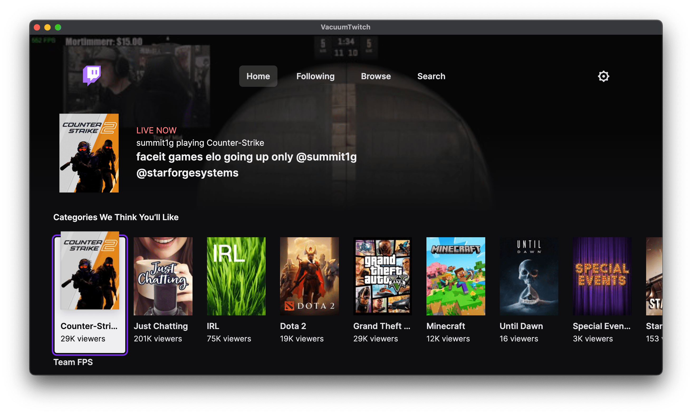

# VacuumTwitch



VacuumTwitch is an unofficial wrapper of Twitch Leanback/starshot64 (the console and Smart TV version of Twitch) for the desktop, with a minor enhancements.

## What exactly is this?

It is **not** a custom client, Twitch Leanback (starshot64) is an official interface. This project simply encompasses it and makes it usable as a standalone desktop application.

VacuumTwitch implementing controller *and* touch support, and overall making it a much better experience.

## Installing

### Windows

If you don't know the difference, pick the Installer.

- [Installer](https://github.com/superkeka/VacuumTwitch/releases/latest/download/VacuumTwitch-Setup.exe)
- Portable:
  - [x64 / amd64](https://github.com/superkeka/VacuumTwitch/releases/latest/download/VacuumTwitch-x64-Portable.zip)
  - [Arm® 64](https://github.com/superkeka/VacuumTwitch/releases/latest/download/VacuumTwitch-arm64-Portable.zip)

### Mac
No macOS builds available yet.

### Linux

In most cases, you very likely want to use the [Flatpak](https://flathub.org/apps/rocks.shy.VacuumTwitch), which works across all distributions and common architectures.

Otherwise, you can use a distribution package or a portable one. If you don't know the difference, you likely want amd64.

- amd64 / x86_64
  - [AppImage](https://github.com/superkeka/VacuumTwitch/releases/latest/download/VacuumTwitch-x86_64.AppImage)
  - [Ubuntu/Debian/Mint (.deb)](https://github.com/superkeka/VacuumTwitch/releases/latest/download/VacuumTwitch-amd64.deb)
  - [tarball](https://github.com/superkeka/VacuumTwitch/releases/latest/download/VacuumTwitch-x64.tar.gz)
- Arm® 64 / aarch64
  - [AppImage](https://github.com/superkeka/VacuumTwitch/releases/latest/download/VacuumTwitch-arm64.AppImage)
  - [Ubuntu/Debian/Mint (.deb)](https://github.com/superkeka/VacuumTwitch/releases/latest/download/VacuumTwitch-arm64.deb)
  - [tarball](https://github.com/superkeka/VacuumTwitch/releases/latest/download/VacuumTwitch-arm64.tar.gz)

## Building from Source

Builds will be created in the dist/ folder

```sh
git clone https://github.com/superkeka/VacuumTwitch
cd VacuumTwitch

# Install Dependencies
npm i

# Run without packaging
npm run start

# Or package release builds
npm run build
```

## Credits

This project is a modified fork of [VacuumTube](https://github.com/shy1132/VacuumTube)

Originally created by [@shy1132](https://github.com/shy1132) — huge thanks for the great work!
